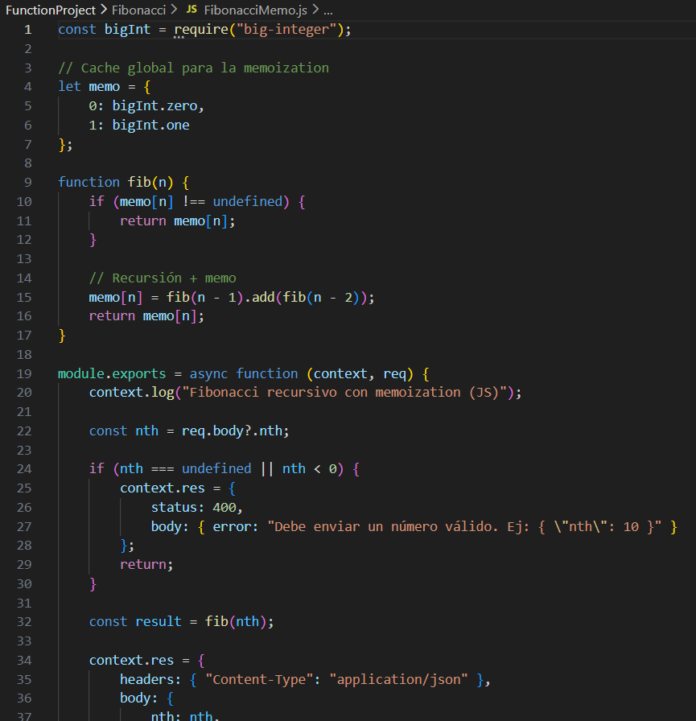

# Escuela Colombiana de Ingeniería
## Arquitecturas de Software - ARSW
### Escalamiento en Azure con Máquinas Virtuales, Scale Sets y Service Plans

**Autor:** Daniel Ricardo Ruge Gómez

---

# Parte 0 – Entendiendo el escenario de calidad

## 1.Creación de recursos

## 2.Instalación de la extensión para Visual Studio Code

## 3.Despliegue de la función

  

## 4.Pruebas de funcionamiento

  

---

# 5.Ejecución concurrente con Newman

Se modificó la colección de Postman para permitir el envío de 10 peticiones concurrentes utilizando Newman.

  

---

# Nueva función: Fibonacci recursivo con memoization (Node.js)

---

## Conclusiones

Al probar la función recursiva con memoization con los valores 1000, 10000 y 50000, se observó lo siguiente:

- Para 1000 y 10000 el tiempo de ejecución fue prácticamente inmediato gracias a que cada valor se calcula una sola vez y luego se reutiliza mediante memoization.
- Para 50000 la función sigue siendo más eficiente que la recursiva tradicional, pero puede presentar riesgos como:
  - Desbordamiento de pila (stack overflow) por la profundidad de la recursión.
  - Alto consumo de memoria por el tamaño de los números y la tabla de memoization.
  - Limitaciones del motor de JavaScript (ausencia de optimización de recursión en cola).

---

# Preguntas

## 1. ¿Qué es un Azure Function?

Un Azure Function es un servicio *serverless* que permite ejecutar código sin necesidad de administrar servidores. Azure se encarga del aprovisionamiento, el escalado automático y la infraestructura necesaria. Las funciones se ejecutan bajo demanda y solo se paga por el tiempo real de uso.

---

## 2. ¿Qué es serverless?

Serverless es un modelo de computación donde el desarrollador no administra servidores directamente. Implica:

- No configurar hardware.
- No realizar mantenimiento.
- No pagar por tiempo ocioso.
- Escalamiento automático administrado por el proveedor.

Azure Functions es un ejemplo de una arquitectura totalmente serverless.

---

## 3. ¿Qué es el runtime y qué implica seleccionarlo al crear el Function App?

El *runtime* es el entorno en el que se ejecutarán las funciones. Algunos ejemplos: Node.js, .NET, Python, Java, PowerShell.

Seleccionarlo implica definir:

- El lenguaje y la versión permitida para esa Function App.
- La estructura y archivos que tendrán las funciones.
- Que todas las funciones dentro del mismo Function App deben usar ese runtime.
- Que no puede cambiarse después de creado el Function App.

---

## 4. ¿Por qué es necesario crear un Storage Account junto con un Function App?

Azure Functions depende del Storage Account para su operación interna. Se utiliza para:

- Almacenar logs y diagnósticos.
- Manejar triggers (colas, timers, blobs).
- Coordinar el escalado entre múltiples instancias.
- Guardar configuraciones internas y estados temporales.

Sin un Storage Account, la Function App no puede crearse ni ejecutarse.

---

## 5. ¿Cuáles son los tipos de planes para un Function App? ¿En qué se diferencian? Ventajas y desventajas

### 5.1 Consumption Plan
**Descripción:** Plan serverless por excelencia.

**Ventajas:**
- Pago solo por ejecución.
- Autoescalado completo.
- Hasta 1 millón de ejecuciones gratuitas por mes.

**Desventajas:**
- Tiempo de arranque en frío (cold start).
- Límite de tiempo por ejecución (10 min, hasta 30 con configuración).

### 5.2 Premium Plan
**Descripción:** Instancias pre-calientes y siempre activas.

**Ventajas:**
- No hay cold start.
- Ejecuciones sin límite de tiempo.
- Soporta redes privadas (VNet Integration).

**Desventajas:**
- Más costoso que Consumption.
- Se paga al menos 1 instancia aunque no haya tráfico.

### 5.3 App Service Plan
**Descripción:** Funciones corren sobre una máquina virtual dedicada.

**Ventajas:**
- Sin límites de tiempo de ejecución.
- Permite usar siempre la misma máquina.
- Útil si ya se usa App Service para otros servicios.

**Desventajas:**
- No es serverless.
- Se paga 24/7 independientemente del uso.
- Mayor administración y mantenimiento.

---

## 6. ¿Por qué la memoization puede fallar o no funcionar correctamente?

En valores muy altos (p. ej. 50 000) puede fallar por:

- Recursión demasiado profunda → stack overflow.
- Números Fibonacci grandes requieren *BigInt*, que consume mucha memoria.
- La tabla de memoization puede almacenar decenas de miles de valores grandes.
- JavaScript no cuenta con optimización de recursión en cola (TCO).

---

## 7. ¿Cómo funciona el sistema de facturación de las Function App?

Depende del plan:

### 7.1 Consumption Plan
Se cobra por:
- Número de ejecuciones.
- Tiempo de ejecución.
- Memoria utilizada.

Incluye 1 millón de ejecuciones gratis al mes.

### 7.2 Premium Plan
Se cobra por:
- Cantidad de instancias pre-calentadas.
- Tiempo de ejecución adicional.

### 7.3 App Service Plan
Se cobra por:
- La máquina virtual dedicada, independiente del uso.

---

## 8. Informe

Un Azure Function permite ejecutar lógica sin administrar servidores, aprovechando la arquitectura serverless para escalar automáticamente. La memoization mejora el rendimiento del cálculo de Fibonacci, pero puede verse limitada por la recursión y el consumo de memoria. La elección del plan (Consumption, Premium o App Service) afecta costos, rendimiento y características (escalabilidad, cold start, tiempo máximo de ejecución). El Storage Account es obligatorio porque soporta internamente la Function App.

