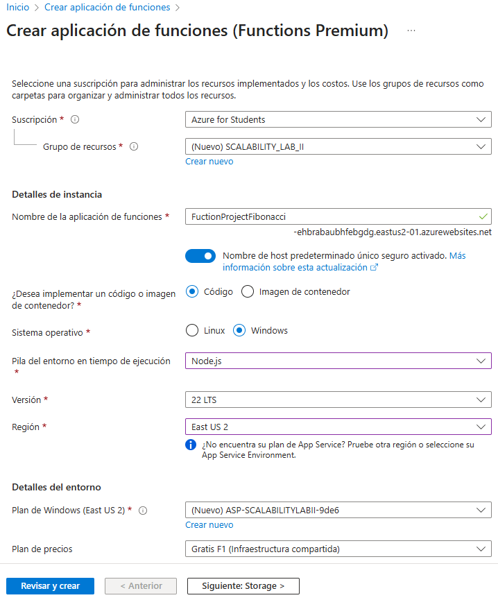
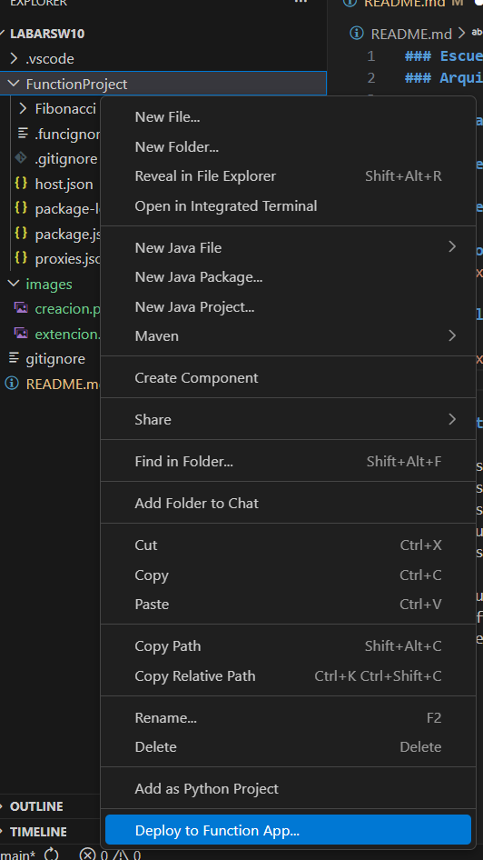
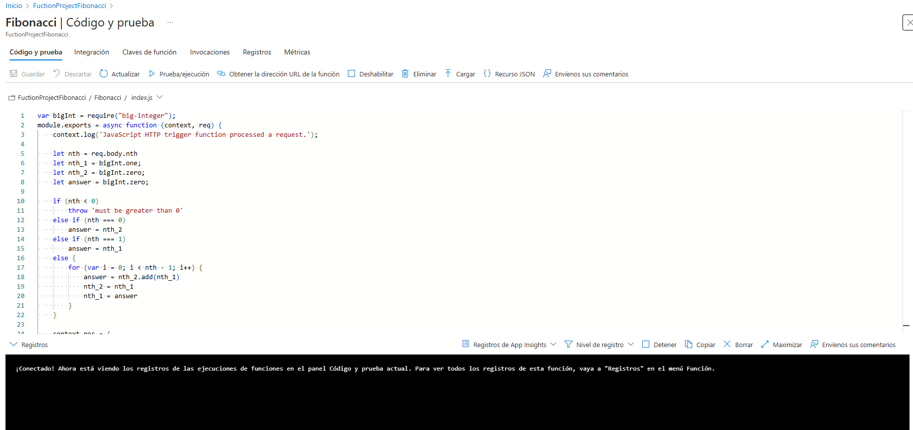
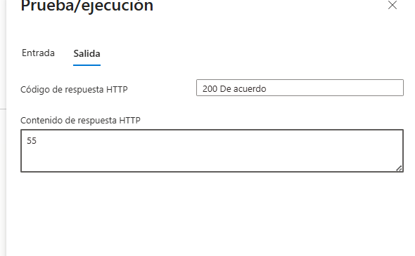
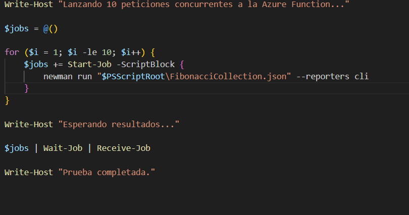

### Escuela Colombiana de Ingeniería
### Arquitecturas de Software - ARSW

## Escalamiento en Azure con Maquinas Virtuales, Sacale Sets y Service Plans

### Daniel Ricardo Ruge Gomez

### Parte 0 - Entendiendo el escenario de calidad

## creamos 

## instalamos la extencion para visual

## desplegamos

## probamos

### Modificamos la coleción de POSTMAN con NEWMAN de tal forma que pueda enviar 10 peticiones concurrentes.

**Preguntas**

* ¿Qué es un Azure Function?
* ¿Qué es serverless?
* ¿Qué es el runtime y que implica seleccionarlo al momento de crear el Function App?
* ¿Por qué es necesario crear un Storage Account de la mano de un Function App?
* ¿Cuáles son los tipos de planes para un Function App?, ¿En qué se diferencias?, mencione ventajas y desventajas de cada uno de ellos.
* ¿Por qué la memoization falla o no funciona de forma correcta?
* ¿Cómo funciona el sistema de facturación de las Function App?
* Informe
